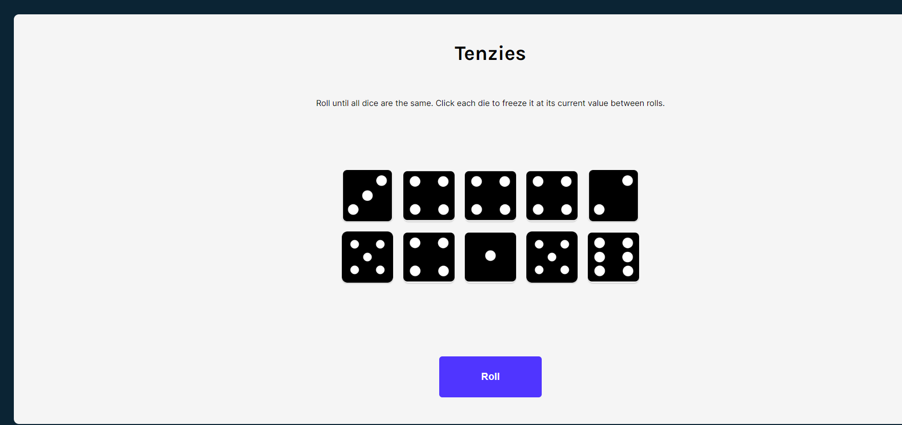
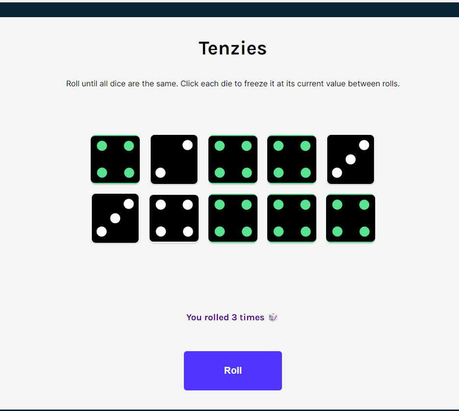
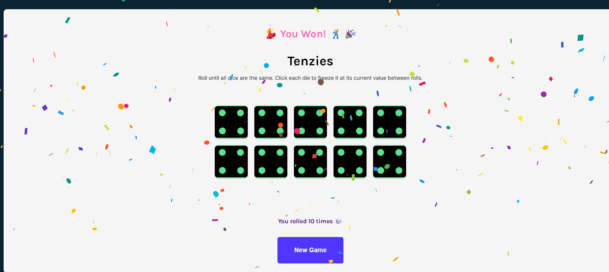

# Tenzie Game

Tenzie is a dice game.
Every player gets 10 dice. The objective of the game is to all the roll the dice as fast as possible, the player who gets all dice on the same number wins the game.

### How to play ?

- Roll dice to get new value
- freeze similar dice number which doesnot change on next dice roll
- do this till all dice has same number

1. Let's start playing by freezing dice having same number and click on Roll to get new numbers on other dice.

2. Roll until you get same number on every dice

3. You win!

